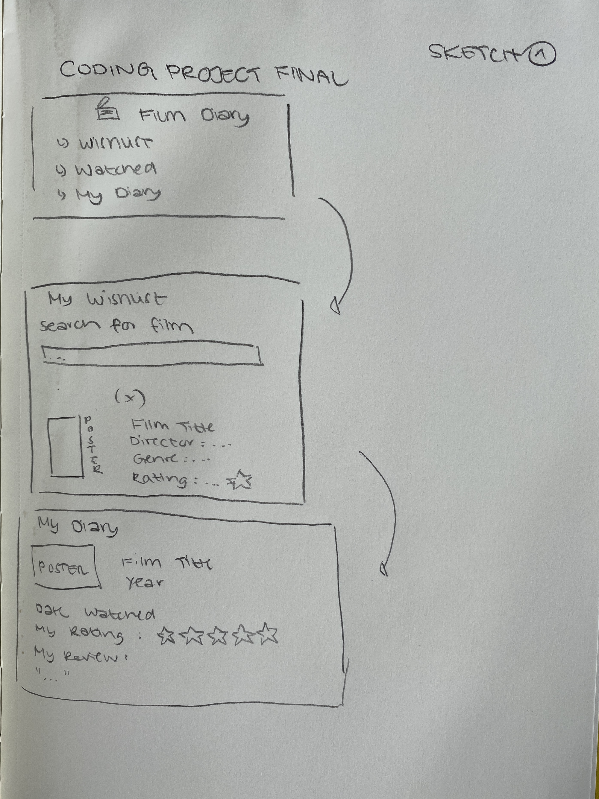
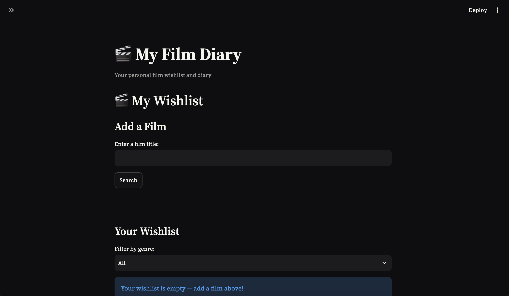
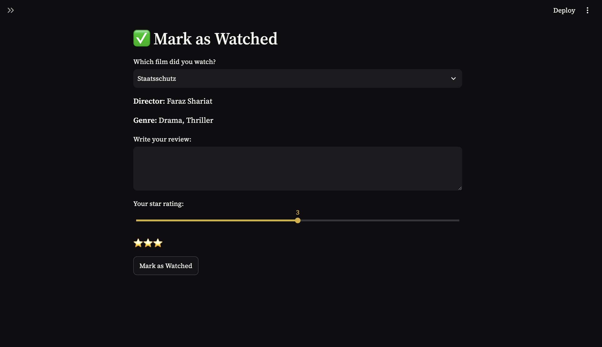
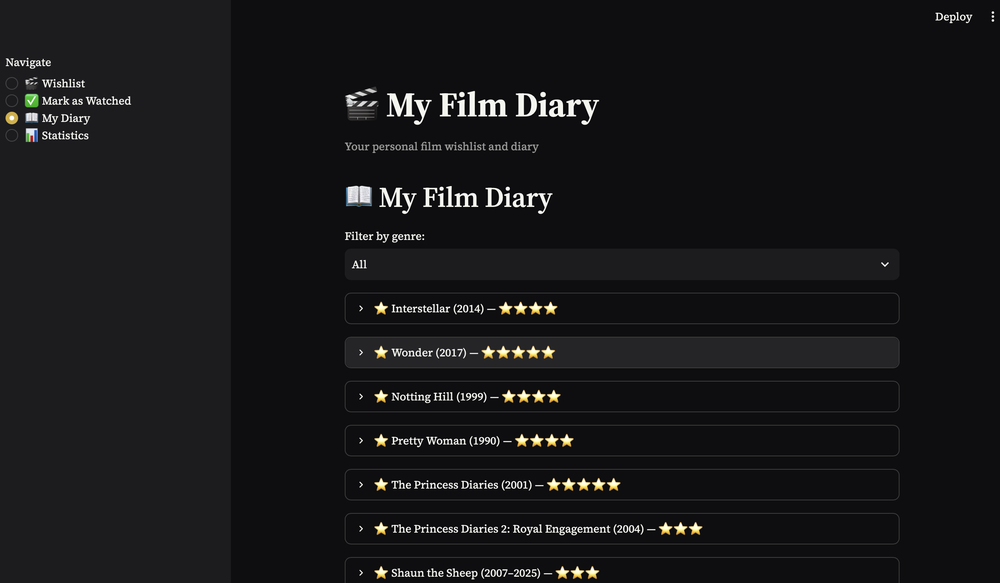
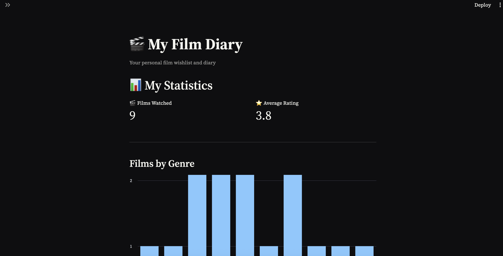

# My Film Diary — Project Documentation

## 1. Project Overview
My project is a personal film diary. It is a Streamlit application where I can research for films, save films I want to watch, and keep track of films I have already watched. Additionally, I can give reviews and ratings. The application uses the OMBd API to automatically retrieve information about films. 

## 2. Motivation and Initial Idea
The idea for a personal film diary came to me in the first class, when we were introduced to the seminar and first spoke about the final assessment. Just a month before, I was able to work at the Berlinale, the International Film Festival in Berlin, in the Jury Office, where I got to not only watch films (with the International Jury) but also experienced how the jury discussed the films, what mattered to them and how they break down the different aspects of a „good“ film. I have previously used the platform Letterboxd to keep track of the films I consume. However, after a couple of years, it has yet become another social media platform for me, where I interact with friends. With the aim to reduce my social media consumption and trying to consume films in a more focused way, I started to think about keeping an analogue film diary. While that is a beautiful way to connect your thoughts after seeing a film, it sometimes comes a little unhandy. Furthermore, I soon realised that only one notebook is not going to contain enough pages. In our first class, I got the idea, that I can combat this problem myself by trying to build my own application.

## 4. Initial Sketch

## 5. Planned Features
Initial Features:
•	Search for films
•	Add films to wishlist
•	Retrieve film information from OMBd
•	Display film poster: reworked the film-adding flow so that teaching now shows a preview
•	Display information (director, genre, year)
•	Mark films as watched
•	Give personal rating
•	Write a review
•	Display watched films in diary
Later ideas:
•	Save films between sessions, prevent duplicate films, statistics, genre filtering

## 6. Project Development

Further ideas that came during the process:
•	Save films between sessions
•	Prevent duplicate films
•	Statistics
•	Genre Filtering

## 7. Technical Explanation
Python: 
The main programming language used for my application is Python. I sued it to create the application logic and handle the data. Furthermore it is used to control what is displayed on each page and communicate with the OMDb API. With using functions, I am able to divide the program into smaller sections (displaying wishlist, saving data, etc.). 

Streamlit:
The class where we used Streamlit was one of my favorites because it created the feeling of build a website. That is why I decided to use Streamlit to turn the code into an interactive web application, also because I know that it was doable for my current skill set. It was helpful that I could create the interface directly in Python using Streamlit commands. The sidebar is used to navigate between the different pages of the application (wishlist, my diary, mark as watched, statistics). 
Streamlit also enabled me to add interactive elements like buttons, sliders, text input, menus and filters. 

OMDb API:
After presenting my idea in class, I looked closely into working with open APIs. The OMDb API provides information about films, like title, year, genre, and even the poster and the IMDb rating. Entering a film title into the search box, the function (search_film()) sends a request to the OMDb API using the 'requests' library, which the application then uses to display the information of the search result. 

JSON storage:
The films are stored in the diary as I used a JSON file, which is useful as it stores information in a structured format that Python can easily read.

I divided the project into different functions, each having a specific task/purpose. The page functions then use these functions to create the different parts of the application. E.g., the Wishlist page uses search_film() to find a film and save_films() to add it to the JSON file. 
This structure makes the code easy to understand and it is much easier to find and then fix problems as different tasks are separated.

## 8. Difficulties and Solutions
I encountered multiple difficulties from the start. While I first started with a very simple code, where I had to add the information of a film manually, I soon knew I had to connect it to an API. The hint that I got in class about Open APIs helped. I had to make sure that different pages work correctly and that the films were saved properly. 
While developing the application, I often had multiple small issues that I needed to fix separately, and while doing so, sometimes I would accidentally delete a whole block of code. I had to test different parts of the code and be careful to look and be specific where my problem was. I worked through those issues step by step, used error messages, tested features individually and used AI as a support tool for specific coding problems or when I had to understand parts of the code that were new to me. 

## 9. AI Usage and References
Date | Source / Tool | What used for             | Learnings
-------------------------------------------------------------
07/26| Claude        | adding a statistics page  | Learned to use st.metric and st.bar_chart
07/26| Claude        | styling the app           | Learned about streamlet's streamline/config.toml theme file
07/26| ChatGPT       | debugging                 | found my mistake, had to remove the API key holder
08/26| Claude        | adding genre filter dropdowns | Used Python sets to collect unique values without duplicates, wrote a reusable helper function (get_unique_genres) instead of repeating logic on both pages
08/26| Claude        | debugging (IntendationError)| had to traceback python errors, avoided partial overlaps with deleting an old function

## 10. Testing
- tested main functions of the application
  - tested searching for films by entering different titles
  - checked that the application displayed information correctly when the film was found
  - tested what happened when no film was found or when there was a connection issue to the API
  - tested if there was no internet

## 11. Design
The idea about how I want to design the application came during the coding process. I wanted to keep it relatively dark and connect the design choices to the features. That is why I e.g. chose a golden tone for the slider as it was supposed to match the rating star. I kept the focus on the user experience and did not go crazy on further visual designs, but mostly focused on a clean look.

## 12. Final Application
The final product now is an interactive personal film diary. It is built with Python and Streamlit, and allows to search for films, add them to a wishlist, mark them as watched and write personal reviews, etc. 

Wishlist

Mark as Watched 

My Diary

Statistics

## 14. Reflection
This project taught me about the whole process, from start to finish (while this application could get developed further). I learned that I had to both think of it as a complete application and whole, but it comes down to writing individual pieces of code. Most interesting to me personally was how the different technologies work together (Python, Streamlit, JSON and the external API).
Debugging definitely took a relatively large amount of my time, but I became more comfortable with finding mistakes. In the beginning I almost thought with every mistake I found that I would have to start again, but I learned how to research and find tools that help.
There are certain functions and features I would add if I worked on the project for longer, I would improve the user experience; making it even easier to look for films, I would maybe add film recommendations. Currently one can only mark a film as watched when not only rating it but also writing something. I would edit the code so that you can also just mark something as watched, without giving a review. And finally, I would edit the design and make it a little more 'cozy' and personal.
Overall, I am quite proud of how far I have come, given I had to really look into the slides and our content of the course again. But it was definitely a satisfying experience to start the semester without never having encountered coding really (apart from DataX) to now having build my own application.

